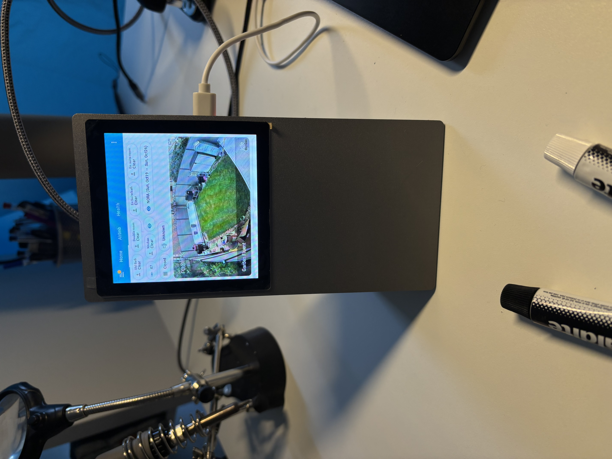
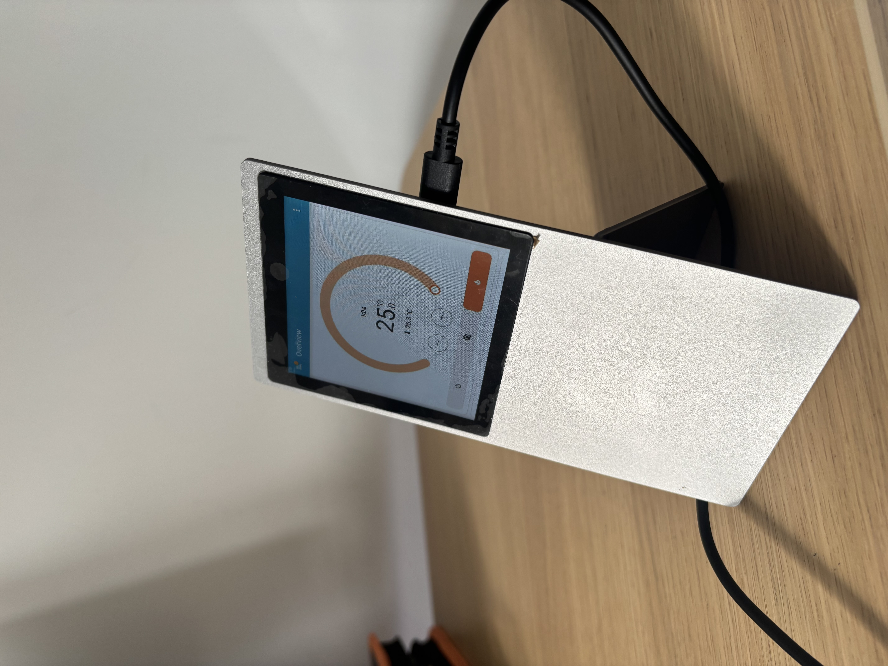
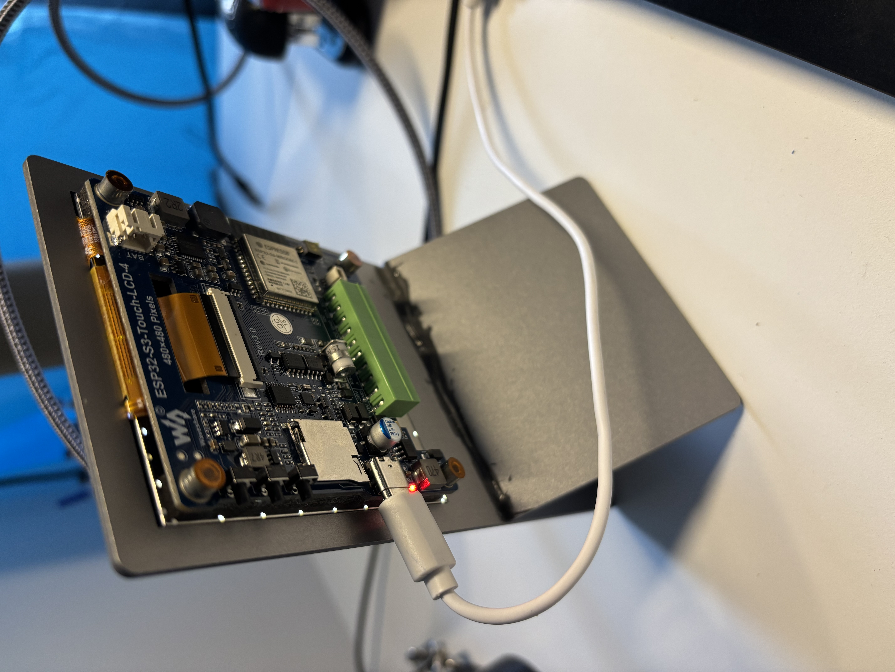

# 🖥️ Waveshare ESP32-S3-Touch-LCD-4 (480×480, Rev 3.0) – Home Assistant Dashboard Display 

[](https://esphome.io/)
[](https://www.home-assistant.io/)
[](./LICENSE)
[](https://www.waveshare.com/esp32-s3-touch-lcd-4.htm)

> 🧠 Bring your **Waveshare ESP32-S3-Touch-LCD-4 (480×480 Pixels, Rev 3.0)** to life as a **live, touch-enabled Home Assistant dashboard** using ESPHome and Strange-V’s RemoteWebView system.  Huge thanks to Ukrainian Developer [@strange-v](https://github.com/strange-v) for the incredible RemoteWebViewClient and Server projects that make this setup possible!  


Even though the ESP32-S3 can’t run a full web browser, this project makes it possible to **view and interact** with your Home Assistant dashboard — rendered remotely and streamed to the display in real time.

Here’s the Waveshare ESP32-S3 dashboard in action:







# Inspiration 
I really wanted a homebrew Pimoroni Presto to be a desktop home assistant powered doorbell intercom.  I went as far as getting aluminum sheet laser-cut to the right size at JLCPCB.  The first one promptly snapped on trying to bend it into the pimoroni L shape - totally crap aluminium.  Some cold weld turned the broken bit into a y shape stand.  Improvise. Adapt.  Overcome.

---

## 📑 Table of Contents
- [Overview](#-overview)
- [Hardware](#-hardware)
- [Software Stack](#-software-stack)
- [Configuration](#-configuration)
- [Network Layout](#-network-layout)
- [Interactivity](#-interactivity)
- [Recommended Dashboard Setup](#-recommended-dashboard-setup)
- [Quick Start](#-quick-start)
- [Docker Deployment](#-docker-deployment)
- [Demo](#-demo)
- [Future Improvements](#-future-improvements)
- [Credits](#-credits)
- [License](#-license)

---

## 🚀 Overview

This setup turns the **ESP32-S3 Touch LCD** into a **remote web terminal** for Home Assistant.

A Linux server renders your dashboard in **headless Chromium**, sends it as compressed frames to the ESP32 over **WebSockets**, and receives touch input back for full interactivity.

---

## 🧩 Hardware

| Component | Description |
|------------|-------------|
| 🧠 **Main Board** | [Waveshare ESP32-S3-Touch-LCD-4 (Rev 3.0)](https://www.waveshare.com/esp32-s3-touch-lcd-4.htm) |
| 💡 **Display** | ST7796 480×480 LCD (SPI) |
| ✋ **Touch Controller** | GT911 (I²C) |
| 🔋 **Memory** | 16 MB Flash / 8 MB PSRAM |
| 🌐 **Connectivity** | Wi-Fi (with fallback AP) |
| 💡 **Backlight** | Controlled via PWM (`light.display_backlight` in Home Assistant) |

---

## 🧰 Software Stack

| Component | Role | Repository / Docs |
|------------|------|------------------|
| **ESPHome** | Firmware framework | [esphome.io](https://esphome.io/) |
| **RemoteWebViewClient** | WebView streaming client for ESPHome | [strange-v/RemoteWebViewClient](https://github.com/strange-v/RemoteWebViewClient) |
| **RemoteWebViewServer** | Headless Chromium renderer | [strange-v/RemoteWebViewServer](https://github.com/strange-v/RemoteWebViewServer) |
| **JPEG Decoder** | Efficient frame decoding | [strange-v/jpegdec-esphome](https://github.com/strange-v/jpegdec-esphome) |
| **Home Assistant** | Dashboard source | [home-assistant.io](https://www.home-assistant.io/) |
| **Server OS** | Ubuntu Server 24.x | — |

---

## ⚙️ Configuration

The ESPHome YAML is included under [`/esphome.yaml`](./esphome.yaml).

## 🐳 Docker Deployment

In this setup, the **RemoteWebViewServer** (which handles the Chromium rendering and WebSocket streaming) is deployed using **Docker** for simplicity and reliability.  
You can deploy it using other methods if preferred (for example, directly from source or in a Python virtual environment), but Docker provides an isolated, portable, and easy-to-update runtime.

Below is the `docker-compose.yml` entry used for this project:

```yaml
services:
  #-------------------
  # Home Assistant Dashboard Server
  #-------------------
  rwvserver:
    image: strangev/remote-webview-server:latest
    container_name: remote-webview-server
    restart: unless-stopped
    environment:
      SCREEN_W: 480
      SCREEN_H: 480
      TILE_SIZE: 32
      FULL_FRAME_TILE_COUNT: 1
      FULL_FRAME_AREA_THRESHOLD: 0.50  # Match your client YAML settings
      FULL_FRAME_EVERY: 50              # Match your client YAML settings
      EVERY_NTH_FRAME: 1
      MIN_FRAME_INTERVAL_MS: 80
      JPEG_QUALITY: 85
      MAX_BYTES_PER_MESSAGE: 61440
      WS_PORT: 8181
      DEBUG_PORT: 9221
      HEALTH_PORT: 18080
      USER_DATA_DIR: /pw-data
    ports:
      - "8181:8181"   # WebSocket port (update if needed)
      - "9222:9222"   # Debug / DevTools port (optional)
    volumes:
      - ./pw-data:/pw-data   # Persistent user data (browser cache, cookies)
    shm_size: 2gb
    healthcheck:
      test: ["CMD-SHELL", "curl -fsS http://localhost:18080 || exit 1"]
      interval: 10s
      timeout: 3s
      retries: 5
      start_period: 10s
```

🧩 How It Works

When you start the container (docker compose up -d rwvserver), it launches a headless Chromium browser inside the container.

The browser opens the URL specified in your ESPHome YAML (remote_webview → url:).

The server captures the rendered output as JPEG tiles, compresses them, and streams them to your ESP32 over WebSockets.

Touch inputs from the ESP32 are sent back to the server, which injects them into the browser for full interactivity.

⚙️ Notes

Update the ports section (8181, 9222) to suit your local setup — especially if you already have services using those ports.

The ./pw-data volume stores Chromium’s persistent session data, so your dashboard can remain logged in.

FULL_FRAME_* and TILE_SIZE values should match your ESPHome YAML configuration for best performance.

### Highlights
- Secure Home Assistant API with encryption  
- OTA updates  
- Display backlight exposed as a controllable light entity  
- Touch-enabled web dashboard via `remote_webview`  
- Configurable dashboard URL via Home Assistant text entity  

---

## 🌐 Network Layout

| Component | Example Address | Description |
|------------|-----------------|--------------|
| **Home Assistant** | `http://homeassistant.local:8123` | Serves the dashboard web UI |
| **RemoteWebViewServer** | `http://server.local:8181` | Streams rendered frames |
| **ESP32-S3 Device** | DHCP / Static | Connects to Wi-Fi and WebView server |

---

## 🖱️ Interactivity

- The GT911 touchscreen sends touch coordinates back to the server  
- The server injects these events into the headless Chromium browser  
- Fully interactive Lovelace dashboards — toggles, sliders, buttons, etc.  

---

## 🧠 Recommended Dashboard Setup

While this setup works with any existing Home Assistant dashboard, you’ll get **much better usability** if you create a **custom Lovelace view optimized for 480×480 resolution** — larger buttons, minimal text, and simple layouts.

You can then configure your **RemoteWebViewServer** to point to that dashboard by default for a seamless panel experience.

---

## ⚡ Quick Start

# 1. Clone This Repository

# 2. Adjust Secrets in esphome yaml
# Create or update your secrets.yaml with your Wi-Fi and API credentials.

# 3. Flash the Device
# Use ESPHome (CLI or dashboard) to upload the firmware:
esphome run esphome/esp32-lcd4-ha.yaml

# 4. Run the RemoteWebViewServer
# Follow instructions from the RemoteWebViewServer repo to install and launch it on Ubuntu Server:
# https://github.com/strange-v/RemoteWebViewServer

# 5. Connect and Enjoy
# - Power up the ESP32-S3
# - It connects to your Wi-Fi and streams the dashboard from your Home Assistant instance
# - Interact directly via touch on the display!
